Just-in-time
============
Toon Nolten

.. image:: image/cc_by.png

JIT
===
* Combineert interpretatie en AOT compilatie
* Snelheid van gecompileerde code
* Flexibiliteit van geïnterpreteerde code (bvb. platform onafhankelijk)
* Overhead van interpretatie
* Overhead van compilatie

Java
====
HotSpot Performance Engine
--------------------------
* Gecompileerd naar bytecode (platform onafhankelijk)
* Bytecode initïeel geïnterpreteerd
* Per methode wordt beslist om te compileren
* *Client* en *Server* VM's

Python
======
* Dynamische taal
* AOT compilatie is niet altijd mogelijk
* (Wel mogelijk voor RPython)

PyPy
====
* Meta tracing JIT
* Per trace wordt beslist om te compileren
* Niet het programma maar de interpreter wordt getraced
* Laat toe andere talen gebruik te laten maken van de JIT

  * Prolog
  * Smalltalk
  * JavaScript
  * Scheme
  * Ruby
  * PHP

Just-in-time
============
Register Allocatie
------------------
* Intermediate Representation: oneindig veel *temporaries*
* Processor: beperkt aantal registers (k)
* Elke temporary moet toegewezen worden aan een register of het geheugen
* *Registers zijn veel sneller*

Register Allocatie
==================
* Liveness analyse: waarden die live zijn moeten ergens opgeslagen worden
* Interference graph: waarden die interfereren (tegelijk live zijn)
  moeten op verschillende plaatsen opgeslagen worden
* k-kleuring van grafen is te traag voor just-in-time compilatie

Linear Scan
===========
* Geef alle instructies uit de IR een nummer
* De volgorde maakt niet uit
  (zelfde als in de IR van het programma, diepte-eerst)
  , zolang de ordening totaal is
* Voor liveness een ruwe benadering: wat is het eerste en laatste moment dat
  de waarde live is?

  Dit geeft een *live interval* voor elke temporary

Linear Scan
===========
Algoritme
---------
* Sorteer de live intervallen op beginwaarde
* Aantal benodigde registers veranderd alleen wanneer een live interval
  begint of eindigt
* Gebruik een *greedy strategie* om registers toe te wijzen

Linear Scan
===========

.. parsed-literal::

    **LinearScanRegisterAllocation**
         *active* ← {}
         **foreach** live interval *i*\ , in order of increasing start point
            **ExpireOldIntervals**\ (\ *i*\ )
            **if** length(\ *active*\ ) = *k* **then**
               **SpillAtInterval**\ (\ *i*\ )
            **else**
               *register*\ [\ *i*\ ] ← a register removed from pool of
                              free registers
               add *i* to *active*\ , sorted by increasing end point

.. parsed-literal::

    **ExpireOldIntervals**\ (\ *i*\ )
        **foreach** interval *j* **in** *active*\ , in order of increasing end point
            **if** *endpoint*\ [\ *j*\ ] ≥ *startpoint*\ [\ *i*\ ] **then**
                **return**
            remove *j* from *active*
            add *register*\ [\ *j*\ ] to pool of free registers

.. parsed-literal::

    **SpillAtInterval**\ (\ *i*\ )
        *spill* ← last interval in *active*
        **if** *endpoint*\ [\ *spill*\ ] > *endpoint*\ [\ *i*\ ] **then**
            *register*\ [\ *i*\ ] ← *register*\ [\ *spill*\ ]
            *location*\ [\ *spill*\ ] ← new stack location
            remove *spill* from *active*
            add *i* to *active*\ , sorted by increasing end point
        **else**
            *location*\ [\ *i*\ ] ← new stack location

Voorbeeld *k* = 3
=================

.. parsed-literal::

    **LinearScanRegisterAllocation**
         *active* ← {}
         **foreach** live interval *i*\ , in order of increasing start point
            **ExpireOldIntervals**\ (\ *i*\ )
            **if** length(\ *active*\ ) = *k* **then**
               **SpillAtInterval**\ (\ *i*\ )
            **else**
               *register*\ [\ *i*\ ] ← a register removed from pool of
                              free registers
               add *i* to *active*\ , sorted by increasing end point

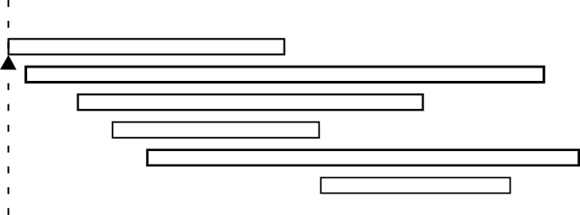

Voorbeeld *k* = 3
=================

.. parsed-literal::

    **LinearScanRegisterAllocation**
         *active* ← {}
         **foreach** live interval *i*\ , in order of increasing start point
            **ExpireOldIntervals**\ (\ *i*\ )
            **if** length(\ *active*\ ) = *k* **then**
               **SpillAtInterval**\ (\ *i*\ )
            **else**
               *register*\ [\ *i*\ ] ← a register removed from pool of
                              free registers
               add *i* to *active*\ , sorted by increasing end point

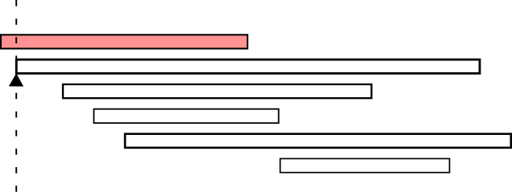

Voorbeeld *k* = 3
=================

.. parsed-literal::

    **LinearScanRegisterAllocation**
         *active* ← {}
         **foreach** live interval *i*\ , in order of increasing start point
            **ExpireOldIntervals**\ (\ *i*\ )
            **if** length(\ *active*\ ) = *k* **then**
               **SpillAtInterval**\ (\ *i*\ )
            **else**
               *register*\ [\ *i*\ ] ← a register removed from pool of
                              free registers
               add *i* to *active*\ , sorted by increasing end point

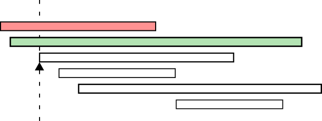

Voorbeeld *k* = 3
=================

.. parsed-literal::

    **LinearScanRegisterAllocation**
         *active* ← {}
         **foreach** live interval *i*\ , in order of increasing start point
            **ExpireOldIntervals**\ (\ *i*\ )
            **if** length(\ *active*\ ) = *k* **then**
               **SpillAtInterval**\ (\ *i*\ )
            **else**
               *register*\ [\ *i*\ ] ← a register removed from pool of
                              free registers
               add *i* to *active*\ , sorted by increasing end point

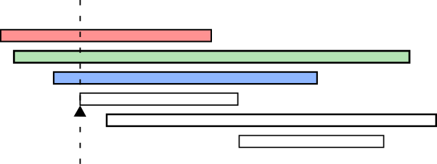

Voorbeeld *k* = 3
=================

.. parsed-literal::

    **SpillAtInterval**\ (\ *i*\ )
        *spill* ← last interval in *active*
        **if** *endpoint*\ [\ *spill*\ ] > *endpoint*\ [\ *i*\ ] **then**
            *register*\ [\ *i*\ ] ← *register*\ [\ *spill*\ ]
            *location*\ [\ *spill*\ ] ← new stack location
            remove *spill* from *active*
            add *i* to *active*\ , sorted by increasing end point
        **else**
            *location*\ [\ *i*\ ] ← new stack location

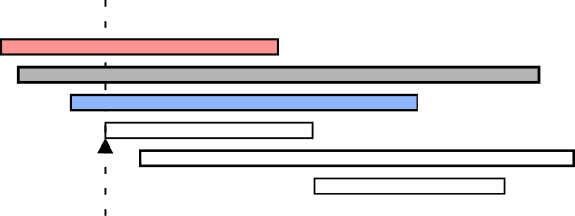

Voorbeeld *k* = 3
=================

.. parsed-literal::

    **LinearScanRegisterAllocation**
         *active* ← {}
         **foreach** live interval *i*\ , in order of increasing start point
            **ExpireOldIntervals**\ (\ *i*\ )
            **if** length(\ *active*\ ) = *k* **then**
               **SpillAtInterval**\ (\ *i*\ )
            **else**
               *register*\ [\ *i*\ ] ← a register removed from pool of
                              free registers
               add *i* to *active*\ , sorted by increasing end point

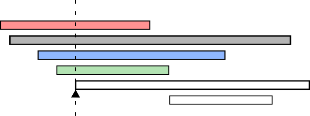

Voorbeeld *k* = 3
=================

.. parsed-literal::

    **SpillAtInterval**\ (\ *i*\ )
        *spill* ← last interval in *active*
        **if** *endpoint*\ [\ *spill*\ ] > *endpoint*\ [\ *i*\ ] **then**
            *register*\ [\ *i*\ ] ← *register*\ [\ *spill*\ ]
            *location*\ [\ *spill*\ ] ← new stack location
            remove *spill* from *active*
            add *i* to *active*\ , sorted by increasing end point
        **else**
            *location*\ [\ *i*\ ] ← new stack location

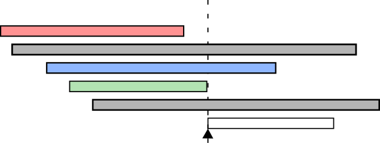

Voorbeeld *k* = 3
=================

.. parsed-literal::

    **ExpireOldIntervals**\ (\ *i*\ )
        **foreach** interval *j* **in** *active*\ , in order of increasing end point
            **if** *endpoint*\ [\ *j*\ ] ≥ *startpoint*\ [\ *i*\ ] **then**
                **return**
            remove *j* from *active*
            add *register*\ [\ *j*\ ] to pool of free registers

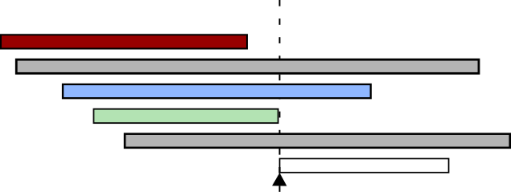

Voorbeeld *k* = 3
=================

.. parsed-literal::

    **LinearScanRegisterAllocation**
         *active* ← {}
         **foreach** live interval *i*\ , in order of increasing start point
            **ExpireOldIntervals**\ (\ *i*\ )
            **if** length(\ *active*\ ) = *k* **then**
               **SpillAtInterval**\ (\ *i*\ )
            **else**
               *register*\ [\ *i*\ ] ← a register removed from pool of
                              free registers
               add *i* to *active*\ , sorted by increasing end point

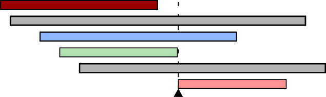

Voorbeeld *k* = 3
=================

.. parsed-literal::

    **ExpireOldIntervals**\ (\ *i*\ )
        **foreach** interval *j* **in** *active*\ , in order of increasing end point
            **if** *endpoint*\ [\ *j*\ ] ≥ *startpoint*\ [\ *i*\ ] **then**
                **return**
            remove *j* from *active*
            add *register*\ [\ *j*\ ] to pool of free registers

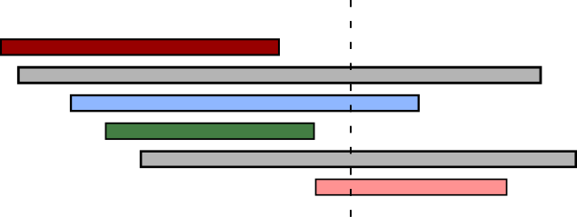

Voorbeeld *k* = 3
=================

.. parsed-literal::

    **ExpireOldIntervals**\ (\ *i*\ )
        **foreach** interval *j* **in** *active*\ , in order of increasing end point
            **if** *endpoint*\ [\ *j*\ ] ≥ *startpoint*\ [\ *i*\ ] **then**
                **return**
            remove *j* from *active*
            add *register*\ [\ *j*\ ] to pool of free registers

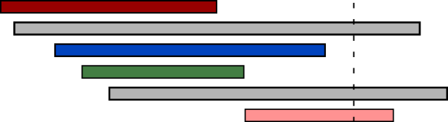

Voorbeeld *k* = 3
=================

.. parsed-literal::

    **ExpireOldIntervals**\ (\ *i*\ )
        **foreach** interval *j* **in** *active*\ , in order of increasing end point
            **if** *endpoint*\ [\ *j*\ ] ≥ *startpoint*\ [\ *i*\ ] **then**
                **return**
            remove *j* from *active*
            add *register*\ [\ *j*\ ] to pool of free registers

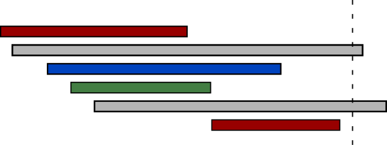

Prestaties
==========
* Veel sneller dan grafenkleuring (lineair)
* 12% tragere code dan grafenkleuring

Second-chance Binpacking
========================
Lifetime holes
--------------
* Periode in een live interval waar de opgeslagen waarde niet wordt gebruikt:
  bvb. tussen een load en een store
* Linear Scan houdt hier geen rekening mee

Voorbeeld *k* = 3
=================
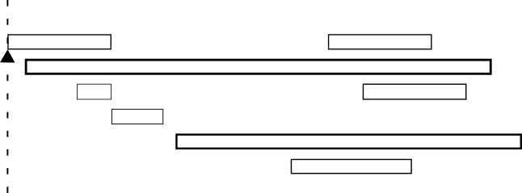

Voorbeeld *k* = 3
=================
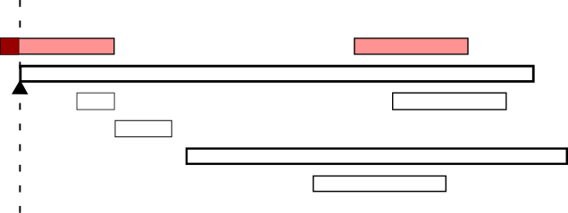

Voorbeeld *k* = 3
=================
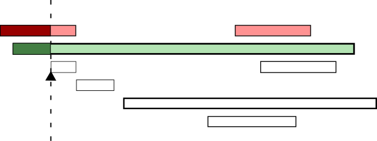

Voorbeeld *k* = 3
=================
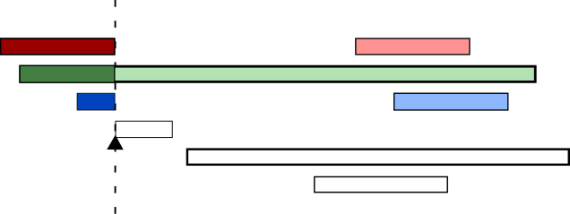

Voorbeeld *k* = 3
=================
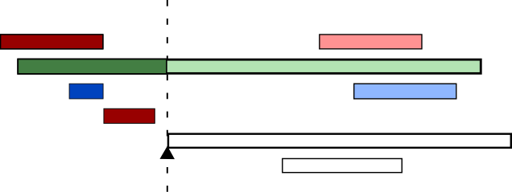

Second-chance allocatie
=======================
* Bij linear scan wordt een waarde gespilled voor de rest van het live interval
* Nu splitsen we het op, voor en na het volgende gebruik
* En spillen tot aan het volgende gebruik
* Zo krijgt de gespilde waarde *opnieuw een kans* om toegewezen te worden aan
  een register

Spilling heuristic
==================
* Linear Scan: laatste eindpunt
* Second-chance Binpacking: Laatste volgende gebruik

Voorbeeld *k* = 3
=================
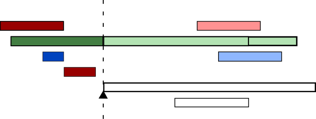

Voorbeeld *k* = 3
=================
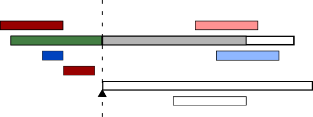

Voorbeeld *k* = 3
=================
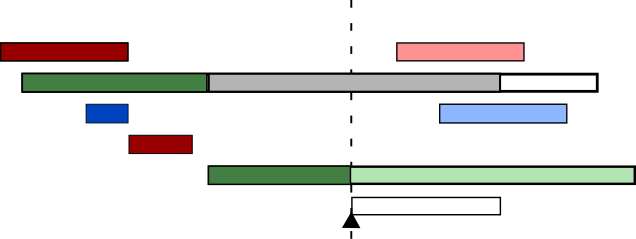

Voorbeeld *k* = 3
=================

Voorbeeld *k* = 3
=================
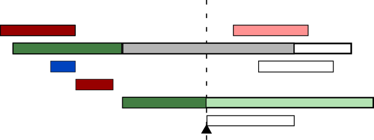

Voorbeeld *k* = 3
=================
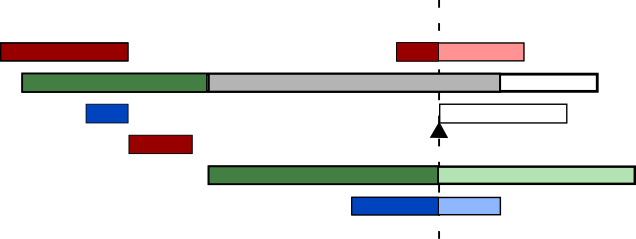

Voorbeeld *k* = 3
=================
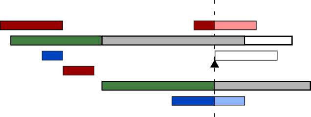

Voorbeeld *k* = 3
=================
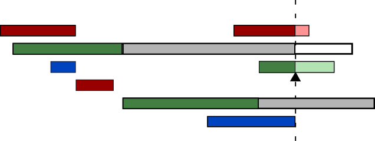

Voorbeeld *k* = 3
=================
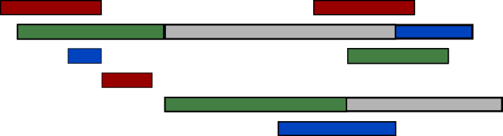

Spill store eliminatie
======================
* Waardes naar het geheugen spillen is duur, dus te vermijden
* Als een waarde eerder al eens gespilled is kan de waarde in het geheugen
  nog hetzelfde zijn
* Om hiervan gebruik te maken houden we bij welke plaatsen in het geheugen
  onaangeraakt blijven

Resolutie
=========
* Control flow is niet lineair (volgt de nummering niet)
* Op verschillende paden kunnen waarden op verschillende plaatsen opgeslagen
  zijn (register/spill of register1/register2)
* Dit lossen we op door moves toe te voegen waar nodig

Voorbeeld
=========
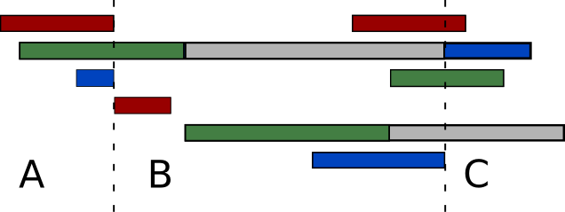

* A → C

  * Groen naar blauw
  * Blauw naar Groen

* B → C

  * Eerste spill naar blauw

Linear Scan en SSA Form
=======================
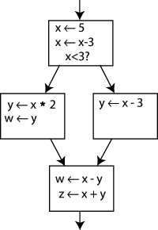

SSA Form
========
.. image:: image/ssa2.png

SSA Form
========
.. image:: image/ssa3.png

Static single assignment form
=============================
* Elke temporary krijgt maar één keer een waarde
* Phi functies op plaatsen waar control flows samenkomen om de juiste waarde
  te kiezen
* Omdat phi functies een probleem vormen voor het bepalen van live intervallen
  voegen we moves toe

Liveness analyse
================
* Verzamelingen van intervallen i.p.v. één live intervall voor de lifetime holes

Coalesce temporaries
====================
* Als de live intervallen van twee temporaries niet overlappen kunnen we ze
  samenvoegen
* Dit doen we voor bvb. de argumenten van phi functies

Inactieve intervallen
=====================
* Actieve intervallen: live en in een register
* Inactieve intervallen: tijdens een lifetime hole maar in een register
* Inactieve intervallen worden apart bijgehouden

Expiring old intervals
======================
* Als het interval voorbij is, is het expired
* Als het interval een lifetime hole bereikt wordt het naar de inactieve
  intervallen verplaatst

Heractiveren van inactieve intervallen
======================================
* Als het inactieve interval ten einde is wordt het expired
* Als het lifetime hole gedaan is wordt het interval terug naar de actieve
  intervallen verplaatst

Een vrij register alloceren
===========================
* Hetzelfde als bij linear scan
* Een register waaraan een inactief interval toegewezen is, is vrij als het
  interval dat we willen toewijzen in het lifetime hole van dat inactief
  interval past

Een interval spillen
====================
* Hetzelfde als bij linear scan
* Inactieve intervallen zijn ook spill kandidaten

Resolutie
=========
* Er worden geen intervallen gesplitst
* Resolutie is dus niet nodig

Optimized Interval Splitting
============================
Een vrij register alloceren
---------------------------
* Op dezelfde manier als bij de SSA Form
* Registers met inactieve intervallen worden als vrij beschouwd maar dan moet
  het interval dat we eraan willen toewijzen gesplitst worden op het einde
  van het lifetime hole van het inactieve interval
* Omdat er gesplitst wordt moeten we opnieuw resolutie toepassen

Optimale splits posities
========================
* Second-chance binpacking splitst zo laat mogelijk
* Nu gebeuren splitsingen op de grenzen van basic blocks (buiten lussen)

Linear Scan Conclusie
=====================
* State of the art voor JIT compilers
* In de eenvoudigste vorm heel makkelijk te implementeren
* Prestatie benaderd grafenkleuring (12%)

Alternatief
===========
*Lossy* Chaitin-Briggs
----------------------
* Chaitin-Briggs grafenkleuring waarbij de interferentie-grafe incrementeel
  wordt aangepast i.p.v. deze volledig opnieuw op te stellen
  (hierdoor wordt deze minder nauwkeurig)
* Dit heeft als gevolg dat de allocatie minder optimaal is maar veel sneller
  kan gebeuren
* Performantie in een JIT 9% beter dan Chaitin-Briggs, 7% beter dan linear scan

Referenties
===========

::

 http://en.wikipedia.org/wiki/Just-in-time_compilation
 http://en.wikipedia.org/wiki/Register_allocation
 http://cs.au.dk/~eernst/dOvsE13/materials/50b-kevin.pdf
 http://en.wikipedia.org/wiki/Static_single_assignment_form
 http://www.cs.ucla.edu/~palsberg/course/cs132/linearscan.pdf
 http://www.eecs.harvard.edu/hube/publications/pldi98-binpack.pdf
 ftp://ftp.ssw.uni-linz.ac.at/pub/Papers/Moe02.PDF
 http://llvm.org/pubs/2006-04-04-CGO-GraphColoring.pdf
